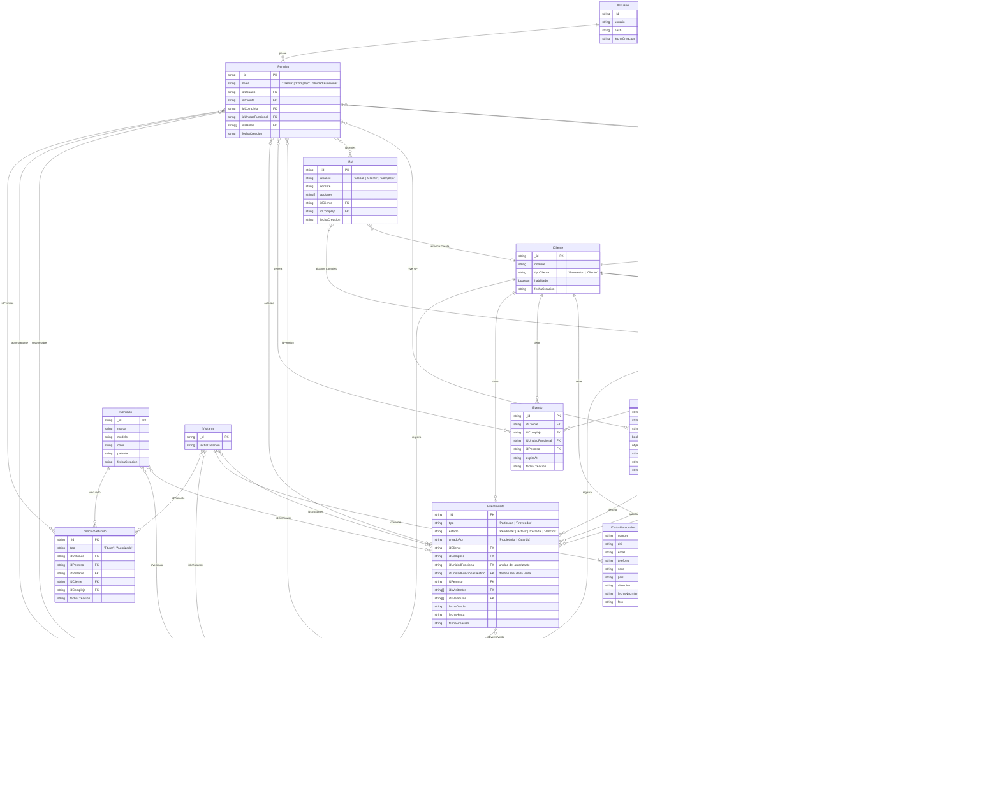

# acceso-modelos

Paquete de interfaces TypeScript compartidas para el sistema de **control de acceso**. Define el modelo de dominio completo utilizado por todos los servicios de la plataforma.

---

## Descripción general

La plataforma permite a empresas administrar el control de acceso físico en complejos habitacionales o comerciales (barrios privados, edificios, condominios). Registra quién entra y sale, por dónde, cuándo, con quién y en qué vehículo. Soporta identificación automática mediante dispositivos (reconocimiento facial, huella digital, tarjetas, teclados numéricos) y registro manual por parte de guardias.

---

## Estructura del modelo

### 1. Arquitectura multi-tenant

El modelo sigue un patrón **multi-tenant** donde tanto el proveedor del software como sus clientes finales se representan con `ICliente`, diferenciados por `tipoCliente`.

| `tipoCliente` | Descripción |
| --- | --- |
| `Proveedor` | Tenant del proveedor del software. Sus usuarios tienen visibilidad global sobre todos los clientes y pueden realizar tareas de administración cross-tenant. |
| `Cliente` | Tenant de un cliente final. Sus usuarios operan únicamente dentro de su propia jerarquía. |

Cada **Cliente** agrupa uno o más **Complejos** (el predio físico: barrio, edificio, condominio), y cada Complejo contiene **Unidades Funcionales** (el espacio individual: departamento, lote, oficina, local).

```
Cliente
 └── Complejo  (Barrio / Edificio / Condominio)
      └── Unidad Funcional  (Departamento / Lote / Oficina...)
```

---

### 2. Usuarios, permisos y roles

Un **Usuario** es una persona con cuenta en el sistema (propietario, residente, empleado de seguridad, administrador, etc.). El usuario en sí es independiente del tenant — lo que lo vincula a un lugar y define qué puede hacer es el **Permiso**.

Un **Permiso** vincula un usuario a un nivel específico de la jerarquía y le asigna uno o más **Roles**:

| `nivel` | Alcance |
| --- | --- |
| `Cliente` | Acceso a toda la estructura del cliente (ej: administrador general) |
| `Complejo` | Acceso a un complejo específico (ej: guardia de seguridad) |
| `Unidad Funcional` | Acceso a una unidad puntual (ej: propietario de un departamento) |

Un **Rol** define el conjunto de acciones habilitadas en el sistema. Los roles también tienen su propio `alcance` (`Global`, `Cliente` o `Complejo`), lo que permite crear roles reutilizables a nivel global o específicos por cliente/complejo.

> `IPermiso` e `IRol` son *discriminated unions* en TypeScript: el campo `nivel` / `alcance` actúa como discriminante y determina qué FKs son requeridas en cada variante.

---

### 3. Accesos físicos y dispositivos

Un **Acceso** representa un punto de entrada/salida físico del complejo (puerta, barrera vehicular, molinete, etc.). Cada acceso define:

- **`tipo`**: si permite ingresos, egresos o ambos.
- **`tipoPersona`**: si es para propietarios/residentes, visitas o ambos.
- **`idsDispositivos`**: los dispositivos instalados en ese punto (puede ser más de uno, ej: cámara + teclado).
- **`ubicacion`**: punto geográfico GeoJSON para su ubicación en un mapa.

Un **Dispositivo** es el hardware instalado en el complejo (terminal de reconocimiento facial, lector de huella, lector de tarjeta, teclado numérico, etc.). Cada dispositivo pertenece a un cliente y complejo.

Dado que cada tipo de dispositivo identifica a las personas con su propio sistema interno (un ID de cara, un número de tarjeta, un código QR, un PIN), la entidad **CredencialDispositivo** actúa como tabla de lookup: vincula el identificador propio del dispositivo (`identificador`) con el permiso correspondiente en el sistema (`idPermiso`). Cuando un dispositivo detecta a alguien, el sistema busca por `(idDispositivo, identificador)` y obtiene el permiso para procesar el acceso.

---

### 4. Registro de movimientos — IngresoEgreso

`IIngresoEgreso` es la entidad transaccional de mayor volumen del sistema. Registra cada evento de entrada o salida con toda la información del momento:

- **Responsable**: el permiso del propietario/residente/empleado que genera el acceso (`idPermiso`).
- **Acompañantes usuarios**: otros usuarios del sistema que ingresan junto al responsable (`idsPermisosAcompanantes`).
- **Acompañantes visitantes identificados**: personas sin cuenta registradas como visitantes (`idsVisitantes`).
- **Acompañantes anónimos**: cantidad de personas no identificadas (`visitantesAnonimos`). Útil cuando el guardia registra "entró el propietario con 3 personas" sin identificarlas.
- **Acceso**: el punto físico por donde se produjo el movimiento (`idAcceso`). A través del acceso se puede saber qué dispositivos participaron.
- **Vehículo**: el vehículo utilizado, si aplica (`idVehiculo`).
- **Aprobación**: si fue aprobado automáticamente por el sistema o manualmente por un guardia (`aprobadoPor`).

Esta entidad se mantiene separada de `IEvento` por diseño: los ingresos/egresos tienen estructura fija, volumen muy alto y requieren índices optimizados. Los eventos son de estructura variable y menor frecuencia.

---

### 5. Visitantes y vehículos — entidades globales

`IVisitante` e `IVehiculo` son entidades **globales**: no pertenecen a ningún tenant. Esto permite que una misma persona o vehículo sea reconocido en múltiples complejos sin duplicar datos.

Su vinculación con el sistema de permisos se gestiona a través de **VínculoVehículo**, que establece una relación many-to-many entre vehículos y personas (usuarios via permiso, o visitantes). Un vehículo puede tener múltiples titulares (ej: pareja que comparte auto) y una persona puede tener múltiples vehículos. El tipo del vínculo (`Titular` o `Autorizado`) distingue el dueño formal de quien tiene acceso autorizado.

Para visitas puntuales donde el vehículo no tiene vínculo registrado, la relación queda implícita en el registro de `IIngresoEgreso`.

---

### 6. Eventos de visita

`IEventoVisita` representa la autorización previa que un propietario (o guardia) crea para habilitar el ingreso de una o más personas en un rango horario determinado. Es la base del flujo de visitas:

1. El propietario declara la visita con anticipación, o el guardia la crea en el momento contactando al propietario por fuera del sistema.
2. Cuando la visita llega, el guardia verifica si existe un evento vigente y aprueba o rechaza el ingreso.
3. Cada `IIngresoEgreso` de los visitantes queda vinculado al evento a través de `idEventoVisita`.
4. El evento se cierra cuando todos los visitantes que ingresaron han registrado su egreso.

Campos clave:
- **`tipo`**: `'Particular'` o `'Proveedor'` (extensible a futuro).
- **`creadoPor`**: distingue si lo creó el propietario o el guardia, usando el mismo `idPermiso` para ambos casos.
- **`idUnidadFuncional`**: unidad del autorizante (para filtrado y contexto).
- **`idUnidadFuncionalDestino`**: destino real de la visita, que puede diferir de la unidad del autorizante (ej: proveedor que va a un espacio común, autorizado por el administrador del complejo).
- **`estado`**: ciclo de vida `Pendiente → Activa → Cerrada / Vencida`.

---

### 7. Unidades funcionales — tipos

`IUnidadFuncional` representa tanto espacios privados (departamentos, lotes, oficinas) como espacios comunes del complejo (canchas, SUM, gimnasio, etc.), diferenciados por el campo `tipo`:

| `tipo` | Descripción |
| --- | --- |
| `Privada` | Espacio de uso exclusivo con propietario/residente asignado |
| `Común` | Espacio compartido del complejo (cancha de tenis, SUM, piscina, etc.) |

Cada unidad puede tener su polígono geográfico (`ubicacion: IGeoJSONPolygon`) para representarla en un mapa del complejo. Esta base será reutilizada en el futuro sistema de reservas de turnos para espacios comunes.

---

### 8. Eventos

`IEvento` representa ocurrencias del sistema que no son ingresos/egresos ni visitas: botón de pánico, alertas de dispositivos, notificaciones, acciones de guardias, etc. Su estructura de datos específica (tipo de evento, descripción, estado) está pendiente de definición.

---

## Diagrama Entidad-Relación



---

## Instalación

### 1. Agregar la dependencia en `package.json`

```json
"acceso-modelos": "git://github.com/GPE-Sistemas/acceso-modelos.git"
```

### 2. Agregar el script de actualización

```json
"acceso-modelos": "yarn upgrade acceso-modelos"
```

### 3. Instalar

```bash
yarn install
```

### 4. Importar las interfaces

```typescript
import { IPermiso, IPermisoCliente, IPermisoComplejo } from 'acceso-modelos/src';
import { IRol, IRolGlobal, ICliente, IComplejo } from 'acceso-modelos/src';
```
