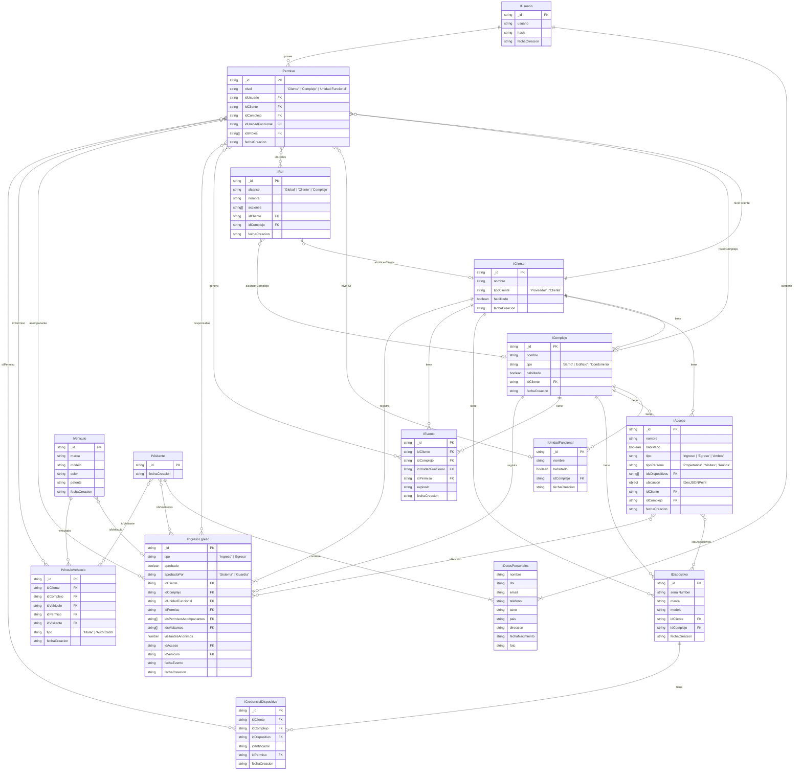

# acceso-modelos

Paquete de interfaces TypeScript compartidas para el sistema de **control de acceso**. Define el modelo de dominio utilizado por todos los servicios de la plataforma.

## Descripción del modelo

El sistema gestiona el acceso de usuarios a espacios físicos organizados jerárquicamente. Un **Cliente** agrupa uno o más **Complejos** (barrios, edificios, condominios), y cada Complejo contiene **Unidades Funcionales** (departamentos, lotes, oficinas, etc.).

Los **Usuarios** obtienen acceso mediante **Permisos**, que vinculan un usuario con un nivel específico de la jerarquía y le asignan uno o más **Roles**. Cada Rol define el conjunto de acciones habilitadas dentro del sistema.

Los **Accesos** representan los puntos de entrada/salida físicos de un complejo (puertas, barreras, molinetes), cada uno con su tipo de tránsito, tipo de persona habilitada, dispositivos asociados y ubicación geográfica. Los accesos físicos se registran mediante **Ingresos/Egresos**, que capturan quién entra o sale, por qué acceso, con qué acompañantes, en qué vehículo y opcionalmente a través de qué dispositivo. Los **Visitantes** y **Vehículos** son entidades globales (no pertenecen a un tenant), y su vinculación con permisos o complejos se gestiona a través de **VínculoVehículo**. Los **Dispositivos** (lectores faciales, de huella, de tarjeta, etc.) se asocian a cada complejo; sus identificadores propios se vinculan a permisos mediante **CredencialDispositivo**, permitiendo que cada tipo de dispositivo identifique personas con su propio formato. Los **Eventos** representan ocurrencias del sistema que no son ingresos o egresos, como alertas o acciones de guardias.

### Tipos de cliente

El modelo sigue un patrón **multi-tenant**: tanto el proveedor del software como sus clientes finales son representados como `ICliente`, diferenciados por el campo `tipoCliente`.

| `tipoCliente` | Descripción |
| ------------- | ----------- |
| `Proveedor`   | Tenant del proveedor del software. Sus usuarios tienen visibilidad global sobre todos los clientes y pueden realizar tareas de administración cross-tenant. |
| `Cliente`     | Tenant de un cliente final. Sus usuarios solo operan dentro de su propia jerarquía de Complejos y Unidades Funcionales. |

> Los usuarios del `Proveedor` participan del mismo modelo de `IPermiso` / `IRol` que cualquier otro usuario, lo que mantiene la lógica de autorización uniforme en toda la plataforma.

### Jerarquía de acceso

```
Cliente
 └── Complejo  (Barrio / Edificio / Condominio)
      └── Unidad Funcional  (Departamento / Lote / Oficina...)
```

Un permiso puede otorgarse a cualquier nivel de la jerarquía:

| `nivel`            | Alcance del acceso                              |
| ------------------ | ----------------------------------------------- |
| `Cliente`          | Acceso a toda la estructura del cliente         |
| `Complejo`         | Acceso a un complejo específico y sus unidades  |
| `Unidad Funcional` | Acceso únicamente a una unidad funcional        |

Los **Roles** también tienen alcance propio (`alcance`), lo que permite definir roles globales reutilizables o roles acotados a un cliente o complejo particular.

---

## Diagrama Entidad-Relación



> **Nota sobre los union types:** `IPermiso` e `IRol` son *discriminated unions* en TypeScript.
> El campo `nivel` / `alcance` actúa como discriminante y determina qué referencias de FK son requeridas u opcionales en cada variante.

> **Nota sobre entidades globales:** `IVehiculo` e `IVisitante` no pertenecen a ningún tenant. Su vinculación con un complejo o usuario se establece a través de `IVinculoVehiculo` (para relaciones persistentes) o queda implícita en el registro de `IIngresoEgreso` (para visitas puntuales).

> **Nota sobre ingresos con acompañantes:** `IIngresoEgreso` distingue tres tipos de acompañantes: usuarios del sistema (`idsPermisosAcompanantes`), visitantes identificados (`idsVisitantes`) y acompañantes no identificados (`visitantesAnonimos`). Pueden combinarse en el mismo registro.

---

## Instalación

### 1. Agregar la dependencia en `package.json`

```json
"acceso-modelos": "git://github.com/GPE-Sistemas/acceso-modelos.git"
```

### 2. Agregar el script de actualización

```json
"acceso-modelos": "yarn upgrade acceso-modelos"
```

### 3. Instalar

```bash
yarn install
```

### 4. Importar las interfaces

```typescript
import { IPermiso, IPermisoCliente, IPermisoComplejo } from 'acceso-modelos/src';
import { IRol, IRolGlobal, ICliente, IComplejo } from 'acceso-modelos/src';
```
